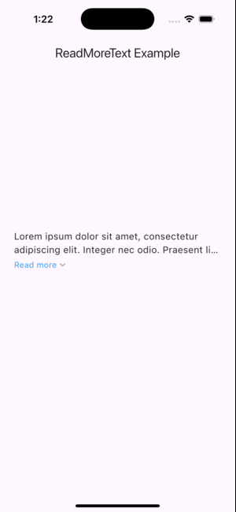

## read_more_codespark: Flutter package for expandable text

This package provides a simple and customizable widget, `ReadMoreCodeSpark`, for displaying expandable text in your Flutter applications. It allows users to easily see truncated text and reveal the full content with a tap.

### Features

* **Expandable Text:** Truncates text after a specified number of lines and provides a toggle to reveal the full content.
* **Customization:** Control text style, minimum lines displayed, overflow behavior, and locale.
* **Easy to Use:** Simple widget with minimal configuration required.

## Screenshot

<!-- 


 -->


### Installation

To use `read_more_codespark` in your Flutter project, add the following line to your `pubspec.yaml` file:

```yaml
dependencies:
  read_more_codespark: ^0.0.5 (or any compatible version)
```

Then, run `flutter pub get` to install the package.

### Usage

Here's how to use `ReadMoreCodeSpark` in your code:

```dart
import 'package:flutter/material.dart';
import 'package:read_more_codespark/read_more_codespark.dart';

void main() {
  runApp(MyApp());
}

class MyApp extends StatelessWidget {
  @override
  Widget build(BuildContext context) {
    return MaterialApp(
      home: Scaffold(
        appBar: AppBar(
          title: Text('Read More Example'),
        ),
        body: Padding(
          padding: const EdgeInsets.all(16.0),
          child: ReadMoreCodeSpark(
            text:
                "This is a long text that will be truncated and shown with a 'show more' indicator. Tapping the indicator will reveal the full content. You can customize the text style, minimum lines displayed, and overflow behavior.",
            textStyle: TextStyle(fontSize: 16.0),
            maxLines: 2,
          ),
        ),
      ),
    );
  }
}
```

This code displays a truncated text with a "show more" indicator. Tapping the indicator reveals the full content. You can customize the appearance and behavior using the following properties:

* `textStyle`: Style the text displayed (e.g., font size, color).
* `text`: The text content to be displayed.
* `maxLines`: The number of lines to display before truncation (defaults to 2).
* `locale`: The locale for text formatting (e.g., date/time formatting).
* `textOverflow`: How to handle overflowing text (defaults to `TextOverflow.ellipsis`).

### Contributing

We welcome contributions to this package! Feel free to fork the repository on GitHub and submit pull requests with improvements or bug fixes.


